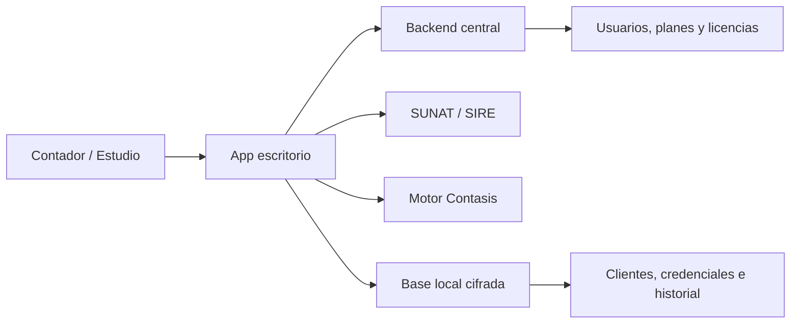

# Plan Fase 1 - Nuevo Producto Comercial SIRE + Contasis

## Contexto

SoftBQ queda como una version finalizada para el cliente actual. El nuevo producto debe nacer como una solucion comercial general para contadores o estudios contables que manejan varios RUCs/clientes.

El objetivo del nuevo producto es:

- Descargar automaticamente informacion desde SUNAT/SIRE.
- Convertir la informacion descargada al formato requerido por Contasis.
- Mantener la carga manual de archivos TXT como respaldo.
- Vender accesos a uno o mas contadores sin que el producto dependa de una sola empresa o cliente.

## Recomendacion Principal

Crear un nuevo proyecto/repositorio con nueva marca comercial.

No conviene renombrar SoftBQ directamente porque SoftBQ ya representa una version personalizada y cerrada. El nuevo proyecto puede reutilizar partes tecnicas de SoftBQ, pero debe tener identidad, arquitectura y flujo comercial propios.

Se puede reutilizar:

- Motor de conversion a Contasis.
- Lectura/parsing de archivos SIRE.
- Generacion de Excel.
- Componentes UI que sigan sirviendo.
- Experiencia aprendida del empaquetado Electron y releases.

Se debe redisenar:

- Marca, icono, instalador y nombre de aplicacion.
- Modelo de usuarios/licencias.
- Modelo multi contador / multi cliente.
- Manejo seguro de credenciales SUNAT.
- Flujo principal basado en descarga automatica desde SUNAT.

## Alcance De La Fase 1

Esta fase no busca construir todo el producto todavia. Busca dejar listas las decisiones base antes de escribir codigo fuerte.

Entregables de esta fase:

1. Nombre comercial elegido.
2. Nombre tecnico del proyecto/repositorio.
3. Definicion del modelo de acceso.
4. Arquitectura inicial.
5. Modelo de datos conceptual.
6. Flujo SIRE esperado.
7. Reglas de seguridad.
8. Backlog MVP.
9. Criterios para empezar desarrollo.

## Identidad Del Producto

La marca debe ser mas general que SoftBQ y debe poder venderse a terceros.

Candidatos:

- ContaSire
- SireFlow
- ContaBridge
- SireContasis
- TaxBridge Peru
- ContaSync Peru

Criterios para elegir:

- Que sea facil de recordar.
- Que no dependa de BQ ni de un cliente especifico.
- Que comunique automatizacion contable.
- Que permita crecer a otros modulos en el futuro.
- Que tenga dominio o redes disponibles si luego se quiere comercializar.

Recomendacion inicial: **ContaBridge** o **ContaSync Peru** si se quiere vender como producto mas amplio. **SireContasis** si se quiere ser muy directo con la promesa comercial.

## Separacion Marca Comercial / Nombre Tecnico

La app debe separar configuracion de marca y configuracion tecnica.

Ejemplo:

- Marca comercial: ContaBridge
- Nombre tecnico/repo: contabridge-desktop
- AppId: com.arian.contabridge
- ProductName: ContaBridge
- Ejecutable: ContaBridge.exe
- Canal releases: contabridge-releases

Esto evita que el codigo quede amarrado a textos visibles o a nombres antiguos.

## Arquitectura Recomendada

Para la primera version comercial:

- App Electron: interfaz, conversion local, descargas SUNAT/SIRE, manejo de archivos.
- Backend central: usuarios, licencias, planes, activaciones y configuracion remota.
- Base local: clientes, historial, archivos generados y credenciales cifradas.

La descarga SIRE deberia vivir inicialmente en la app local, no en el servidor central. Asi se reduce el riesgo de manejar credenciales SOL y secretos SUNAT de todos los clientes en un backend propio desde el primer dia.



## Modelo De Accesos

Para vender a mas contadores, el modelo recomendado es login centralizado con tolerancia offline.

Datos minimos:

- Usuario
- Email
- Rol
- Estado: activo, suspendido o vencido
- Plan
- Fecha de vencimiento
- Limite de RUCs/clientes
- Limite de descargas mensuales, si aplica

Flujo recomendado:

1. El contador inicia sesion.
2. La app valida licencia contra backend central.
3. La app guarda una autorizacion local temporal.
4. Si no hay internet, puede seguir funcionando por algunos dias.
5. Si la licencia vence o se suspende, se bloquean nuevas descargas.

## Modelo Multi Contador / Multi Cliente

Estructura conceptual:

```text
Cuenta / Estudio contable
  Usuarios
  Clientes / RUCs
    Credenciales SUNAT/SIRE
    Descargas ventas
    Descargas compras
    Conversiones Contasis
    Archivos generados
```

Tablas o entidades iniciales:

- accounts
- users
- plans
- subscriptions
- clients
- sunat_credentials
- sire_downloads
- conversions
- generated_files
- audit_logs

Credenciales requeridas por cada cliente/RUC:

```env
SUNAT_RUC=
SUNAT_SOL_USER=
SUNAT_SOL_PASSWORD=
SUNAT_CLIENT_ID=
SUNAT_CLIENT_SECRET=
```

Cada cliente debe habilitar manualmente el consumo de API SUNAT y registrar su aplicacion/credenciales en SUNAT. La app debe asumir que no todos los RUCs estaran listos desde el inicio.

## Onboarding SUNAT Por Cliente

Flujo que debe guiar la app:

1. Registrar cliente/RUC.
2. Confirmar que el cliente tiene clave SOL valida.
3. Habilitar consumo de API SUNAT desde el portal correspondiente.
4. Registrar aplicacion en SUNAT.
5. Copiar Client ID y Client Secret.
6. Guardar credenciales en la app.
7. Probar conexion.
8. Marcar estado del cliente.

Estados sugeridos:

- Pendiente
- Credenciales incompletas
- Conectado
- Error de autenticacion
- Sin permisos API SUNAT
- Requiere revision

## Flujo Principal Del Producto

La carga manual deja de ser la accion principal. El nuevo flujo debe ser:

1. Seleccionar cliente/RUC.
2. Seleccionar periodo.
3. Descargar desde SUNAT/SIRE.
4. Consultar ticket.
5. Descargar ZIP/TXT generado.
6. Extraer y parsear archivos.
7. Mostrar previsualizacion.
8. Validar datos.
9. Convertir a Contasis.
10. Descargar/guardar archivos finales.
11. Guardar historial.

La opcion manual debe quedar como respaldo:

- Importar TXT manualmente.
- Convertir a Contasis.
- Guardar historial como importacion manual.

## Integracion SIRE

La API actual de `api-sunat` ya sirve como base tecnica beta porque puede autenticar, consultar endpoints SIRE y descargar archivos reales. Pero antes de integrarla a un producto comercial debe adaptarse.

Cambios necesarios:

- Dejar de depender de un solo archivo `.env`.
- Recibir credenciales por cliente/RUC.
- Cifrar secretos y claves.
- No imprimir tokens ni credenciales en logs.
- Agregar polling robusto de tickets.
- Manejar errores 401, 403, 404, 429 y errores temporales de SUNAT.
- Separar descarga, parsing, validacion y conversion.
- Guardar historial por cliente, periodo y tipo de libro.

## Polling De Tickets SIRE

SUNAT puede generar tickets y no entregar el archivo inmediatamente. Por eso el sistema debe tener una cola local.

Estados sugeridos:

- Pendiente
- Enviado a SUNAT
- Procesando
- Listo para descargar
- Descargado
- Convertido
- Fallido

Reglas:

- Reintentar cada cierto intervalo.
- Definir maximo de intentos.
- Permitir reintento manual.
- Mostrar error legible al contador.
- Guardar evidencia tecnica para soporte sin exponer credenciales.

## Seguridad Minima

Reglas obligatorias:

- No guardar claves SOL en texto plano.
- No guardar Client Secret en texto plano.
- No subir `.env` ni archivos de credenciales a Git.
- No guardar tokens SUNAT en logs.
- No subir carpetas de reportes reales.
- Cifrar credenciales locales.
- Separar configuracion de desarrollo y produccion.
- Agregar politica de privacidad antes de vender a terceros.

Recomendacion inicial:

- Guardar credenciales cifradas localmente por instalacion.
- Usar backend central solo para licencia, usuario y plan.
- No centralizar credenciales SUNAT hasta tener una politica de seguridad mas madura.

## Plan Comercial Inicial

Propuesta simple para validar mercado:

- Plan Basico: 1 usuario, hasta 5 RUCs, SIRE ventas/compras, conversion Contasis.
- Plan Profesional: hasta 20 RUCs, historial, soporte y actualizaciones.
- Plan Estudio: multiples usuarios, mas RUCs y soporte prioritario.

Precios sugeridos para validar:

- Basico: S/99 mensual.
- Profesional: S/149 a S/199 mensual.
- Instalacion/onboarding: pago unico opcional por configuracion inicial.

La promesa comercial debe ser directa:

> Descarga SIRE automaticamente y convierte a formato Contasis en minutos.

## Backlog MVP

Orden recomendado:

1. Cerrar SoftBQ como version final.
2. Crear nuevo repositorio.
3. Definir marca y configuracion de producto.
4. Crear app Electron base.
5. Agregar login/licencia centralizada.
6. Crear modelo de estudios, usuarios y clientes.
7. Crear gestor de credenciales SUNAT por cliente.
8. Integrar cliente SIRE desde `api-sunat`.
9. Implementar descarga ventas/compras.
10. Implementar polling de tickets.
11. Integrar parser y conversion Contasis.
12. Crear historial de descargas y conversiones.
13. Mantener importacion manual como respaldo.
14. Preparar instalador y canal de releases nuevo.
15. Probar con un contador real antes de vender mas accesos.

## Sprints Sugeridos

### Sprint 0 - Cierre SoftBQ

- Congelar version actual.
- Confirmar release estable.
- Documentar que SoftBQ queda como producto personalizado.
- No mezclar cambios comerciales dentro de SoftBQ.

### Sprint 1 - Nuevo Proyecto Y Marca

- Crear repositorio nuevo.
- Definir nombre comercial.
- Definir appId, productName y nombre del ejecutable.
- Crear configuracion de marca.
- Preparar icono temporal.

### Sprint 2 - Licencias

- Crear backend minimo de usuarios/licencias.
- Login desde app.
- Validacion de plan y vencimiento.
- Tolerancia offline basica.

### Sprint 3 - Multi Cliente

- Crear entidades de estudio, usuarios y clientes.
- Permitir registrar varios RUCs por contador.
- Crear estados por cliente.

### Sprint 4 - Credenciales SUNAT

- Formulario seguro por cliente.
- Validacion de campos.
- Cifrado local.
- Prueba de conexion.

### Sprint 5 - SIRE

- Adaptar `api-sunat` para recibir credenciales dinamicas.
- Consultar periodos.
- Descargar ventas y compras.
- Implementar tickets y reintentos.

### Sprint 6 - Contasis

- Reutilizar motor de conversion.
- Conectar descarga SIRE con conversion.
- Generar archivos finales.
- Guardar historial.

### Sprint 7 - Beta Comercial

- Probar con un contador real.
- Medir errores SUNAT.
- Ajustar onboarding.
- Preparar primera oferta comercial.

## Decisiones Pendientes Antes De Codificar

- Nombre comercial final.
- Nombre del repositorio nuevo.
- Pago unico, suscripcion o ambos.
- Proveedor para backend central.
- Guardar credenciales solo localmente o tambien en servidor.
- Limites por plan.
- Nombre del repo de releases.
- Politica de soporte y onboarding.
- Si la primera version incluira solo SIRE ventas/compras o tambien guias/RHE.

## Criterios Para Considerar Lista La Fase 1

La fase 1 queda lista cuando:

- SoftBQ queda cerrado como producto personalizado.
- Existe nombre comercial elegido.
- Existe decision de arquitectura.
- Existe decision de licenciamiento.
- Existe flujo de credenciales SUNAT por cliente.
- Existe backlog MVP aprobado.
- Existe nuevo repositorio preparado.
- Existe plan de beta con un contador real.

## MVP Recomendado

Primera version comercial:

- Login/licencia simple.
- Gestion de contadores/clientes/RUCs.
- Credenciales SUNAT por cliente.
- SIRE ventas y compras.
- Conversion Contasis.
- Historial.
- Carga manual secundaria.

No incluir todavia:

- Facturacion electronica completa.
- Guias de remision.
- Recibos por honorarios.
- Multiusuario avanzado.
- Credenciales centralizadas en servidor.

Estos modulos pueden venir despues, cuando el producto base ya este validado.
